# Exercícios de Lógica de Programação – UC6

Este repositório contém a lista de **12 exercícios** do arquivo [`02 - Chuunin02.pdf`](./02%20-%20Chuunin02.pdf), juntamente com suas **resoluções em Portugol**.  
Além disso, cada exercício conta com um espaço reservado para **diagramas** explicativos (fluxogramas, diagramas de decisão, etc.).

---

## 📂 Estrutura do Projeto

- `02 - Chuunin02.pdf`: Arquivo com todos os enunciados dos exercícios.
- `CODIGOS PORTUGOL/`: Pasta com todas as soluções em Portugol.
- `DIAGRAMAS/`: Pasta onde serão armazenadas as imagens dos diagramas (uma imagem por exercício).
- `README.md`: Este documento com a resolução dos exercícios.

---.

## 🎨 Legenda - Diagramas

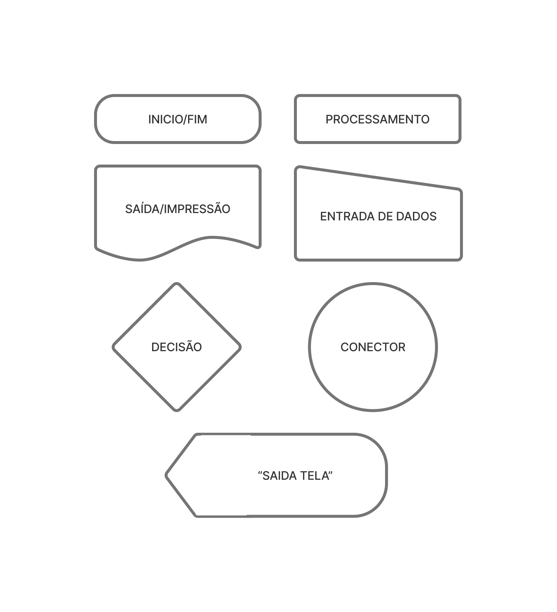

---

## 📝 Exercícios

### 1. Exercício 1
**Enunciado:**  
1.Faça um algoritmo para “Calcular o estoque médio de uma peça”, sendo que:
```
ESTOQUE MÉDIO = (QUANTIDADE MÍNIMA + QUANTIDADE MÁXIMA) / 2
```

**Código:**
```portugol
programa {
  funcao inicio() {
    inteiro minPecas=0,maxPecas=0,estoqueMedia=0
    escreva("Digite a quantidade mínima de peças no estoque: ")
    leia(minPecas)
    escreva("Digite a quantidade máxima de peças no estoque: ")
    leia(maxPecas)

    estoqueMedia = (minPecas+maxPecas)/2
    escreva("A média de peças em estoque é: "+estoqueMedia)
  }
}
```

**Diagrama:**  

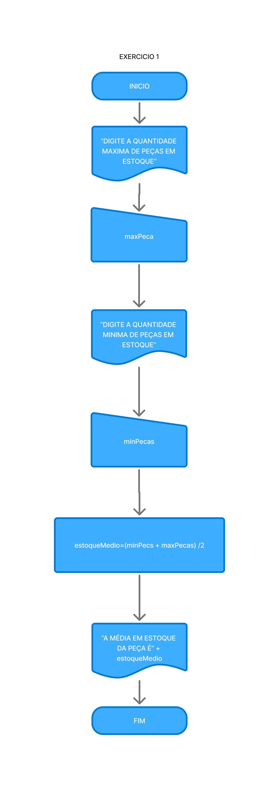

---

### 2. Exercício 2
**Enunciado:**  
2.Faça um programa que calcule a média simples (aritmética) de 3 valores quaisquerinformado pelo usuário. Utilize as variáveis valor1, valor2 e valor3. Exiba a média na tela para o usuário.

**Código:**
```portugol
programa {
  funcao inicio() {
    inteiro valor1=0,valor2=0,valor3=0,total=0
    escreva("Digite um número: ")
    leia(valor1)
    escreva("Digite outro número: ")
    leia(valor2)
    escreva("Digite outro número: ")
    leia(valor3)

    total = (valor1+valor2+valor3)/3
    escreva("A média dos números é: "+total)
  }
}
```

**Diagrama:**  
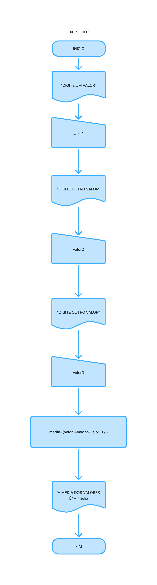

---

### 3. Exercício 3
**Enunciado:**  
 3.Considerando que todos os meses tenham 30 dias, calcular o total de dias de n mesesinformado pelo usuário. Exibir na tela o resultado do cálculo com uma mensagem amigável.

**Código:**
```portugol
programa {
  funcao inicio() {
    inteiro meses=0,calculoDias=0
    escreva("Vamos descobrir quantos dias tem na quantidade de meses que você informar!")
    escreva("\nDigite uma quantidade de meses: ")
    leia(meses)

    calculoDias = meses*30
    escreva("A quantidade de meses informado possui "+calculoDias+" dias!!!")
  }
}
```

**Diagrama:**  
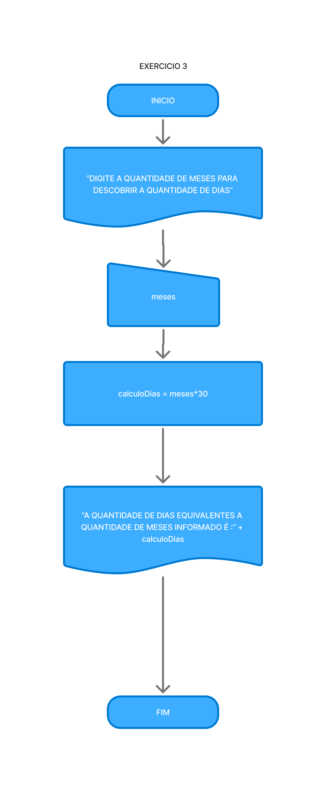

---

### 4. Exercício 4
**Enunciado:**  
4.Faça um algoritmo que leia 5 números do teclado, e faça uma média. 

**Código:**
```portugol
programa {
  funcao inicio() {
    inteiro n1=0,n2=0,n3=0,n4=0,n5=0,calculoMedia=0
    escreva("Vamos calcular a média de 5 números?")
    escreva("\nDigite o primeiro número: ")
    leia(n1)
    escreva("Digite o segundo número: ")
    leia(n2)
    escreva("Digite o terceiro número: ")
    leia(n3)
    escreva("Digite o quarto número: ")
    leia(n4)
    escreva("Digite o quinto número: ")
    leia(n5)

    calculoMedia = (n1+n2+n3+n4+n5)/5
    escreva("A média dos números apresentados é: "+calculoMedia)
  }
}
```

**Diagrama:**  
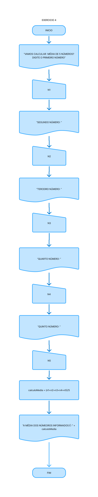

---

### 5. Exercício 5
**Enunciado:**  
5.Faça um algoritmo que leia o nome, o sexo e o estado civil de uma pessoa. Caso sexo seja **“M”** e estado civil seja **“CASADO”**, solicitar o tempo de casada (anos).

**Código:**
```portugol
programa {
  funcao inicio() {
    caracter sexo
    cadeia nome, estadoCivil
    inteiro anosCasado

    escreva ("Informe seu nome: ")
    leia (nome)
    escreva("Qual seu sexo? \nResponda com M ou F: ")
    leia (sexo)
    escreva ("Qual seu estado Civil? [ESCREVA EM LETRAS MAIÚSCULAS] :")
    leia(estadoCivil)

    se ((sexo=="M") e (estadoCivil=="CASADO")){
      escreva("Quantos anos de casado?")
      leia(anosCasado)
      escreva("Parabéns "+nome+" pelos "+anosCasado+" anos de casado")
    }
    senao{
      escreva("Obrigado pelas respostas.")
    }
  }
}
```

**Diagrama:**  
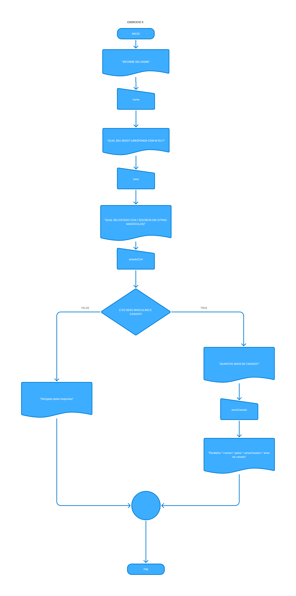

---

### 6. Exercício 6
**Enunciado:**  
6.Elabore um programa que leia dois números reais, a operação aritmética e, então, calcule eimprima o resultado da operação desejada. Utilize os símbolos (`+`,`-`,`*`,`/`) para identificar aoperação aritmética. Caso a operação pretendida seja diferente das implementadas, oprograma deverá exibir a mensagem *“Operação Inválida”* para o usuário.

**Código:**
```portugol
programa {
  funcao inicio() {
    real n1=0,n2=0, resultado=0
    caracter operador

    escreva("#### CALCULADORA ##### \nDigite um número real: ")
    leia(n1)
    escreva("Digite outro número real: ")
    leia(n2)
    escreva("Escolha um operador: [+] [-] [*] [/]: ")
    leia(operador)

    escolha (operador){
      caso "+":
        resultado = n1+n2
        escreva("O resultado é: ",resultado)
        pare
      caso "-":
        resultado=n1-n2
        escreva("O resultado é: ",resultado)
        pare
      caso "*":
        resultado=n1*n2
        escreva("O resultado é: ",resultado)
        pare
      caso "/":
        resultado=n1/n2
        escreva("O resultado é: ",resultado)
        pare
      caso contrario: 
        escreva("Operador Inválido")
    }
  }
}
```

**Diagrama:**  
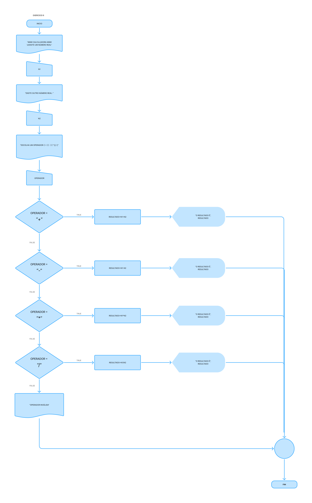

---

### 7. Exercício 7
**Enunciado:**  
7.Faça um algoritmo que leia uma variável e some `5` caso seja **par** ou some `8` caso seja **ímpar**,imprimir o resultado desta operação.

**Código:**
```portugol
programa {
  funcao inicio() {
    real numero=0, soma=0

    escreva("Digite um número, caso ele for par será somado +5, caso for ímpar será somado +8: ")
    leia(numero)

    se (numero%2==0){
      soma=numero+5
      escreva("Resultado: "+numero+"+5="+soma)
    }senao{
      soma=numero+8
      escreva("Resultado: "+numero+"+8="+soma)
    }
  }
}
```

**Diagrama:**  
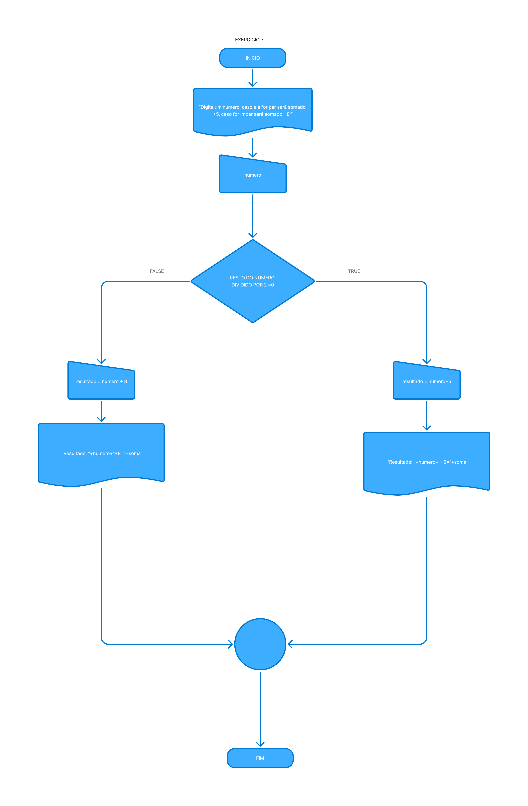

---

### 8. Exercício 8
**Enunciado:**  
8.Escreva um algoritmo que leia três valores **inteiros e diferentes** e mostre-os em ordem **decrescente**.

**Código:**
```portugol
programa {
  funcao inicio() {
    inteiro n1, n2, n3, maior, meio, menor

    escreva("Digite o primeiro número: ")
    leia(n1)
    escreva("Digite o segundo número: ")
    leia(n2)
    escreva("Digite o terceiro número: ")
    leia(n3)

    se (n1 > n2 e n1 > n3) {
      maior = n1
      se (n2 > n3) {
        meio = n2
        menor = n3
      } senao {
        meio = n3
        menor = n2
      }
    } senao se (n2 > n1 e n2 > n3) {
      maior = n2
      se (n1 > n3) {
        meio = n1
        menor = n3
      } senao {
        meio = n3
        menor = n1
      }
    } senao {
      maior = n3
      se (n1 > n2) {
        meio = n1
        menor = n2
      } senao {
        meio = n2
        menor = n1
      }
    }

    escreva("Ordem decrescente: ", maior, ", ", meio, ", ", menor)
  }
}
```

**Diagrama:**  


---

### 9. Exercício 9
**Enunciado:**  
9.Faça um algoritmo que mostre na tela todos os números entre `1` e `100`.

**Código:**
```portugol
programa {
    funcao inicio() {
        inteiro i

        para (i = 1; i <= 100; i++) {
            escreva(i, "\n")
        }
    }
}
```

**Diagrama:**  
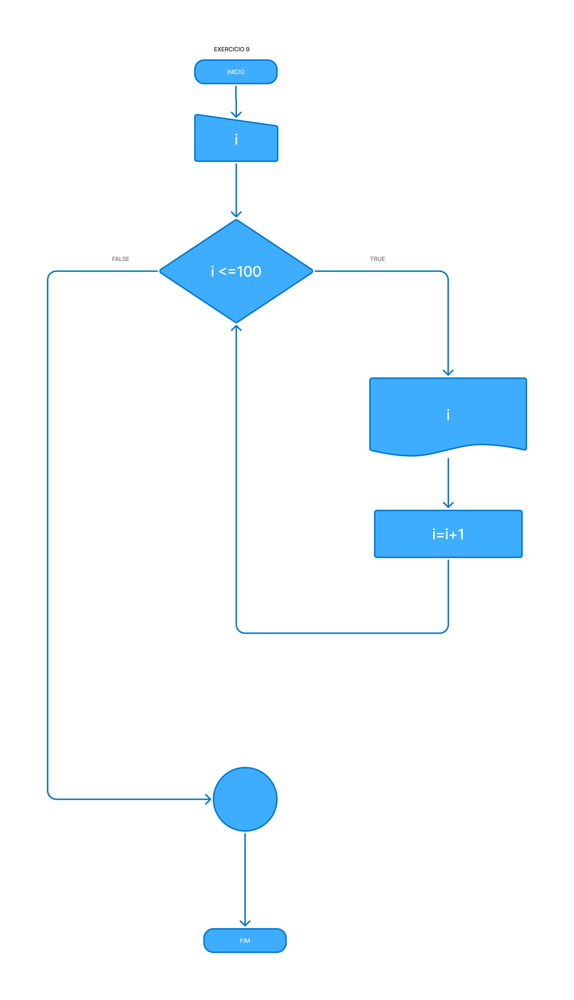

---

### 10. Exercício 10
**Enunciado:**  
10.Desenvolva um gerador de tabuada, capaz de gerar a tabuada de qualquer número inteiroentre `1` a `10` O usuário deve informar de qual numero ele deseja ver a tabuada. A saída deve ser conforme o exemplo abaixo:

```
Tabuada de 5: 
5 X 1 = 5 
5 X 2 = 10 
... 
5 X 10 = 50
```

**Código:**
```portugol
programa {
    funcao inicio() {
        inteiro numero=0, i=0, multiplicacao=0

        escreva("Digite um número entre 1 e 10: ")
        leia(numero)

        se (numero >= 1 e numero <= 10) {
            escreva("Tabuada do ", numero, ":\n")

            para (i = 1; i <= 10; i++) {
                multiplicacao = numero*i
                escreva(numero, " x ", i, " = ", multiplicacao, "\n")
            }
        } senao {
            escreva("Número inválido! Digite entre 1 e 10.\n")
        }
    }
}
```

**Diagrama:**  
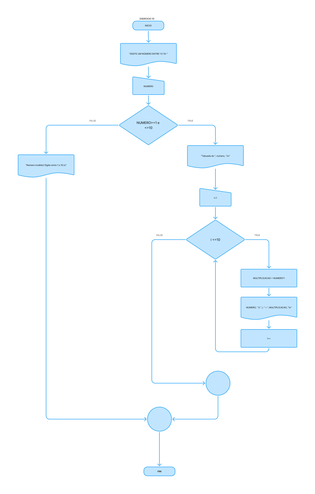

---

### 11. Exercício 11
**Enunciado:**  
 11.Faça um programa que leia um nome de usuário e a sua senha e não aceite a senha igual ao nome do usuário, mostrando uma mensagem de erro e voltando a pedir as informações.

**Código:**
```portugol
programa {
    funcao inicio() {
        cadeia nome="", senha=""

        enquanto (senha == nome) {
            escreva("Nome usuário e senha não podem ser iguais, tente novamente!\n")
            escreva("Digite seu nome usuário: ")
            leia(nome)
            escreva("Digite sua senha: ")
            leia(senha)
        }

        escreva("Logado com sucesso!\n")
    }
}
```

**Diagrama:**  
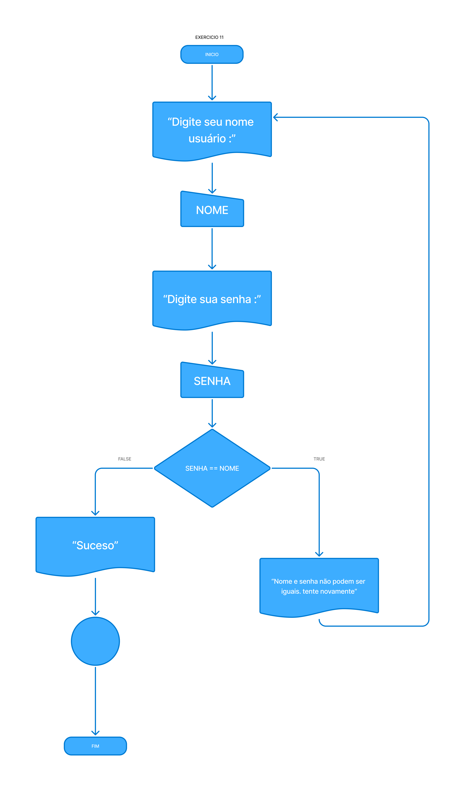

---

### 12. Exercício 12
**Enunciado:**  
 12.Faça um programa que peça uma nota, **entre zero e dez**. Mostre uma mensagem caso o valor seja inválido e continue pedindo até que o usuário informe um valor válido.

**Código:**
```portugol
programa {
    funcao inicio() {
        inteiro nota=0

        escreva("Digite uma nota entre 0 e 10: ")
        leia(nota)

        enquanto (nota<0 e nota>10) {
            escreva("Nota não atende as especificações, tente novamente!\n")
            escreva("Digite uma nota entre 0 e 10: ")
            leia(nota)
        }

        escreva("Sucesso!\n")
    }
}
```

**Diagrama:**  
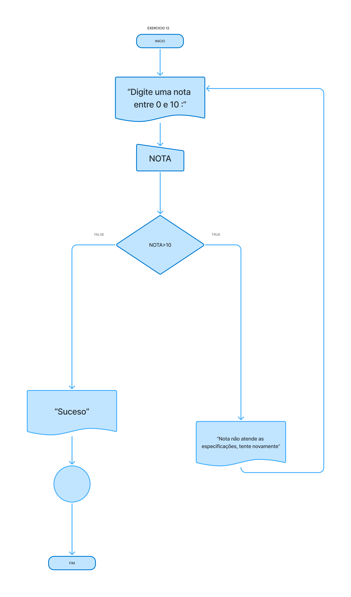

---

## 🚀 Como Usar
1. Leia os enunciados no PDF [`02 - Chuunin02.pdf`](./02%20-%20Chuunin02.pdf).
2. Veja as soluções diretamente acima.
3. Adicione os diagramas na pasta `diagramas/`, nomeados como `exercicioXX.png`.

---

## 📌 Tecnologias Utilizadas
- **Portugol Studio**: Para escrever e executar os algoritmos.
- **FIGMA FigJam**: Para criar os diagramas.
- **Markdown**: Para documentar os exercícios e soluções.

---

## 👤 Autor
**Vilander Adalberto da Silva Costa**